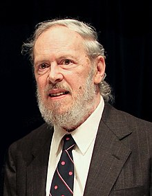

<table class="infobox biography vcard">
<tbody>
<tr>
<th colspan="2">

Dennis Ritchie

</th>
</tr>
<tr>
<td colspan="2">

Dennis Ritchie at the Japan Prize Foundation in May 2011

</td>
</tr>
<tr>
<th scope="row">Born</th>
<td>September 9, 1941 

<a title="Bronxville, New York" href="https://en.wikipedia.org/wiki/Bronxville,_New_York">Bronxville, New York</a>, U.S.

</td>
</tr>
<tr>
<th scope="row">Died</th>
<td><abbr title="circa">c.</abbr>&nbsp;October 12, 2011&nbsp;(aged&nbsp;70) 

<a title="Berkeley Heights, New Jersey" href="https://en.wikipedia.org/wiki/Berkeley_Heights,_New_Jersey">Berkeley Heights, New Jersey</a>, U.S.

</td>
</tr>
<tr>
<th scope="row">Nationality</th>
<td class="category">American</td>
</tr>
<tr>
<th scope="row">Alma&nbsp;mater</th>
<td><a title="Harvard University" href="https://en.wikipedia.org/wiki/Harvard_University">Harvard University</a>&nbsp;(Ph.D., 1968)</td>
</tr>
<tr>
<th scope="row">Known&nbsp;for</th>
<td><a title="ALTRAN" href="https://en.wikipedia.org/wiki/ALTRAN">ALTRAN</a> <a title="B (programming language)" href="https://en.wikipedia.org/wiki/B_(programming_language)">B</a> <a title="BCPL" href="https://en.wikipedia.org/wiki/BCPL">BCPL</a> <a title="C (programming language)" href="https://en.wikipedia.org/wiki/C_(programming_language)">C</a> <a title="Multics" href="https://en.wikipedia.org/wiki/Multics">Multics</a> <a title="Unix" href="https://en.wikipedia.org/wiki/Unix">Unix</a></td>
</tr>
<tr>
<th scope="row">Awards</th>
<td><a title="Turing Award" href="https://en.wikipedia.org/wiki/Turing_Award">Turing Award</a>&nbsp;(1983) <a class="mw-redirect" title="National Medal of Technology" href="https://en.wikipedia.org/wiki/National_Medal_of_Technology">National Medal of Technology</a>&nbsp;(1998) <a title="IEEE Richard W. Hamming Medal" href="https://en.wikipedia.org/wiki/IEEE_Richard_W._Hamming_Medal">IEEE Richard W. Hamming Medal</a>&nbsp;(1990) <a title="Computer Pioneer Award" href="https://en.wikipedia.org/wiki/Computer_Pioneer_Award">Computer Pioneer Award</a>&nbsp;(1994) <a title="Computer History Museum" href="https://en.wikipedia.org/wiki/Computer_History_Museum">Computer History Museum</a>&nbsp;Fellow (1997) <a title="Harold Pender Award" href="https://en.wikipedia.org/wiki/Harold_Pender_Award">Harold Pender Award</a>&nbsp;(2003) <a title="Japan Prize" href="https://en.wikipedia.org/wiki/Japan_Prize">Japan Prize</a>&nbsp;(2011)</td>
</tr>
<tr>
<td colspan="2"><strong>Scientific career</strong></td>
</tr>
<tr>
<th scope="row">Fields</th>
<td class="category"><a title="Computer science" href="https://en.wikipedia.org/wiki/Computer_science">Computer science</a></td>
</tr>
<tr>
<th scope="row">Institutions</th>
<td><a class="mw-redirect" title="Lucent Technologies" href="https://en.wikipedia.org/wiki/Lucent_Technologies">Lucent Technologies</a> <a title="Bell Labs" href="https://en.wikipedia.org/wiki/Bell_Labs">Bell Labs</a></td>
</tr>
</tbody>
</table>
 

<strong>Dennis MacAlistair Ritchie</strong>&nbsp;(September 9, 1941 &ndash;&nbsp;<abbr title="circa">c.</abbr>&nbsp;October 12, 2011)&nbsp;was an American&nbsp;<a title="Computer science" href="https://en.wikipedia.org/wiki/Computer_science">computer scientist</a>.&nbsp;He created the&nbsp;<a title="C (programming language)" href="https://en.wikipedia.org/wiki/C_(programming_language)">C programming language</a>&nbsp;and, with long-time colleague&nbsp;<a title="Ken Thompson" href="https://en.wikipedia.org/wiki/Ken_Thompson">Ken Thompson</a>, the&nbsp;<a title="Unix" href="https://en.wikipedia.org/wiki/Unix">Unix</a>&nbsp;<a title="Operating system" href="https://en.wikipedia.org/wiki/Operating_system">operating system</a>&nbsp;and&nbsp;<a title="B (programming language)" href="https://en.wikipedia.org/wiki/B_(programming_language)">B programming language</a>.&nbsp;Ritchie and Thompson were awarded the&nbsp;<a title="Turing Award" href="https://en.wikipedia.org/wiki/Turing_Award">Turing Award</a>&nbsp;from the&nbsp;<a title="Association for Computing Machinery" href="https://en.wikipedia.org/wiki/Association_for_Computing_Machinery">ACM</a>&nbsp;in 1983, the&nbsp;<a title="IEEE Richard W. Hamming Medal" href="https://en.wikipedia.org/wiki/IEEE_Richard_W._Hamming_Medal">Hamming Medal</a>&nbsp;from the&nbsp;<a title="Institute of Electrical and Electronics Engineers" href="https://en.wikipedia.org/wiki/Institute_of_Electrical_and_Electronics_Engineers">IEEE</a>&nbsp;in 1990 and the&nbsp;<a class="mw-redirect" title="National Medal of Technology" href="https://en.wikipedia.org/wiki/National_Medal_of_Technology">National Medal of Technology</a>&nbsp;from&nbsp;<a title="Bill Clinton" href="https://en.wikipedia.org/wiki/Bill_Clinton">President Bill Clinton</a>&nbsp;in 1999. Ritchie was the head of&nbsp;<a title="Lucent" href="https://en.wikipedia.org/wiki/Lucent">Lucent Technologies</a>&nbsp;System Software Research Department when he retired in 2007. He was the "R" in&nbsp;<a title="The C Programming Language" href="https://en.wikipedia.org/wiki/The_C_Programming_Language">K&amp;R C</a>, and commonly known by his&nbsp;<a title="User (computing)" href="https://en.wikipedia.org/wiki/User_(computing)">username</a>&nbsp;<strong>dmr</strong>.

 

<h2> Publications </h2>

<ul>
 <li><a target="_blank" href="https://github.com/manjunath5496/Dennis-M-Ritchie-papers/blob/master/ist(1).pdf" style="text-decoration:none;">The Development of the C Language</a></li>
  
<li><a target="_blank" href="https://github.com/manjunath5496/Dennis-M-Ritchie-papers/blob/master/ist(2).pdf" style="text-decoration:none;">The M4 Macro Processor</a></li>  
  
<li><a target="_blank" href="https://github.com/manjunath5496/Dennis-M-Ritchie-papers/blob/master/ist(3).pdf" style="text-decoration:none;">The complexity of loop programs</a></li>
                               
 <li><a target="_blank" href="https://github.com/manjunath5496/Dennis-M-Ritchie-papers/blob/master/ist(4).pdf" style="text-decoration:none;">Reflections on Software Research</a></li>                              
<li><a target="_blank" href="https://github.com/manjunath5496/Dennis-M-Ritchie-papers/blob/master/ist(5).pdf" style="text-decoration:none;"> The Evolution of the Unix Time-sharing System </a></li>
 <li><a target="_blank" href="https://github.com/manjunath5496/Dennis-M-Ritchie-papers/blob/master/ist(6).pdf" style="text-decoration:none;">A Stream Input Output System </a></li>
                <li><a target="_blank" href="https://github.com/manjunath5496/Dennis-M-Ritchie-papers/blob/master/ist(7).pdf" style="text-decoration:none;">The UNIX Time-Sharing System  </a></li>                                
          <li><a target="_blank" href="https://github.com/manjunath5496/Dennis-M-Ritchie-papers/blob/master/ist(8).pdf" style="text-decoration:none;">On the Security of UNIX  </a></li>           

<li><a target="_blank" href="https://github.com/manjunath5496/Dennis-M-Ritchie-papers/blob/master/ist(9).pdf" style="text-decoration:none;">C Reference Manual</a></li>
                               
 <li><a target="_blank" href="https://github.com/manjunath5496/Dennis-M-Ritchie-papers/blob/master/ist(10).pdf" style="text-decoration:none;">The Inferno™ Operating System</a></li>                              
<li><a target="_blank" href="https://github.com/manjunath5496/Dennis-M-Ritchie-papers/blob/master/ist(11).pdf" style="text-decoration:none;"> Portability of C Programs and the UNIX System </a></li>
 <li><a target="_blank" href="https://github.com/manjunath5496/Dennis-M-Ritchie-papers/blob/master/ist(12).pdf" style="text-decoration:none;">The UNIX Timesharing System - A Retrospective </a></li>
                <li><a target="_blank" href="https://github.com/manjunath5496/Dennis-M-Ritchie-papers/blob/master/ist(13).pdf" style="text-decoration:none;">The C Programming Language  </a></li>                                
          <li><a target="_blank" href="https://github.com/manjunath5496/Dennis-M-Ritchie-papers/blob/master/ist(14).pdf" style="text-decoration:none;">Unix Programmer's Manual  </a></li>

</ul>
